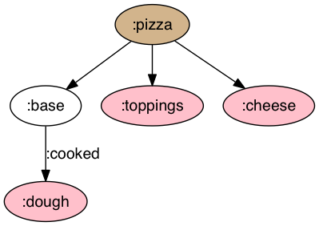
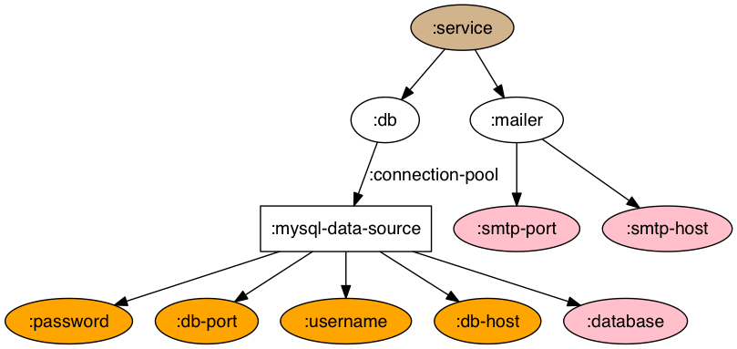

# lein-viz

A Leiningen plugin to visualize graph and tree data.


## Usage

Leiningen coordinates: `[lein-viz "0.3.0"]`

You need to have [Graphviz](http://www.graphviz.org/) installed to use this plugin.

| OS      | How to install             |
|---------|----------------------------|
| Linux   | Using your package manager |
| OS X    | Using [Homebrew](http://brew.sh/) or [download installer](http://www.graphviz.org/Download_macos.php)|
| Windows | [Download installer](http://www.graphviz.org/Download_windows.php) |


### Installation

User-level installation: Put Leiningen coordinate into the `:plugins` vector of your `:user` profile.

Project-level installation: Put Leiningen coordinate into the `:plugins` vector of your `project.clj`.


### Quickstart via command line

```bash
$ echo "{:graph-data {:pizza [:toppings :base :cheese] :base {:cooked :dough}}}" | lein viz -s :stdin
```

This opens a viewer window containing an image as follows:




#### Output image to a file

The image can be output to a file using the `-o filename` switch:

```bash
$ echo "{:graph-data {:pizza [:toppings :base :cheese] :base {:cooked :dough}}}" | lein viz -s :stdin -o pizza.png
```


### Quickstart via code

Visualization data may be generated by project code, which is usually more powerful. Create a function in your project
to return visualization data:

```clojure
(ns  foo.core)

(defn make-graph
  []
  {:graph-data {:service [:db :mailer]
                :db {:connection-pool :datasource}
                :datasource [:db-host :db-port :database :username :password]
                :mailer [:smtp-host :smtp-port]}
   :node-labels {:datasource :mysql-data-source}
   :node-shapes {:datasource :rectangle}
   :seed-keys   [:db-host :db-port :username :password]})

(defn make-tree
  []
  {:tree-data [:foo [10 20] :bar [30 40] :baz [50]]})
```

Then run this plugin:

```
$ lein viz -s foo.core/make-graph
$ lein viz -s foo.core/make-tree
```

The generated graph may look like the below image:




#### Project config

If you want to set the source fn as a default, put the following in `project.clj`:

```clojure
:viz {:default {:source foo.core/make-graph}}
```

Then, because `:default` is a special key, you can simply run:

```
$ lein viz
```

If you have more than one data generators, you can specify them as follows:

```clojure
:viz {:g1 {:source foo.core/make-graph-1}
      :g2 {:source foo.core/make-graph-2}}
```

Then, specify the one you want to visualize:

```
$ lein viz -e :g1
```


## License

Copyright © 2016 Shantanu Kumar (kumar.shantanu@gmail.com, shantanu.kumar@concur.com)

Distributed under the Eclipse Public License either version 1.0 or (at
your option) any later version.
